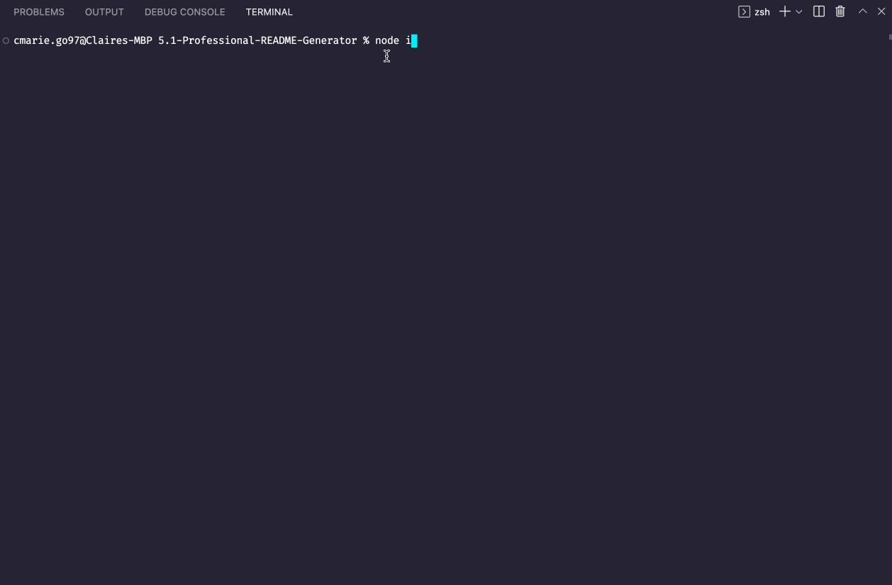
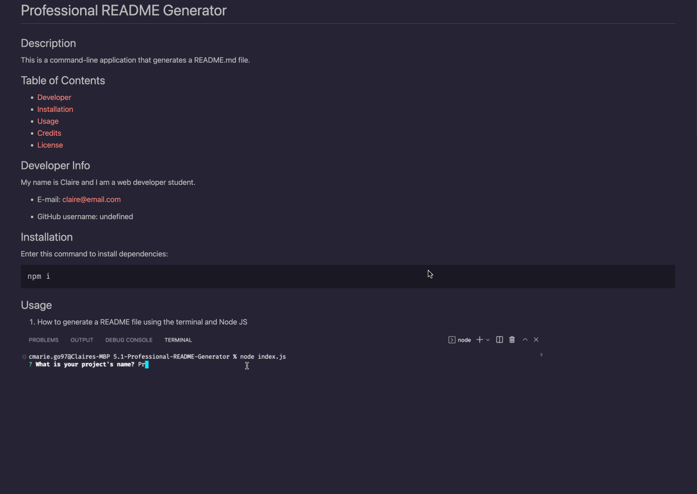

# Professional README Generator

## Description

This is a command-line application that generates a README.md file.

## Table of Contents

- [Developer](#Developer-Info)
- [Installation](#installation)
- [Usage](#usage)
- [Credits](#credits)
- [License](#license)

## Developer Info

My name is Claire and I am a web developer student.

* E-mail: claire@email.com

* GitHub username: undefined

## Installation

Enter this command to install dependencies:

~~~
npm i
~~~

## Usage

1. How to generate a README file using the terminal and Node JS

2. How the generated README file looks:

3. Markdown Preview demo:

type in command "node index.js" in the command line to use.

## Credits

Had some assistance from institution instructors.

--------

## License

 
https://opensource.org/licenses/MIT

## How to Contribute

N/A

## Tests

Enter this command to run tests:

~~~
npm test
~~~
