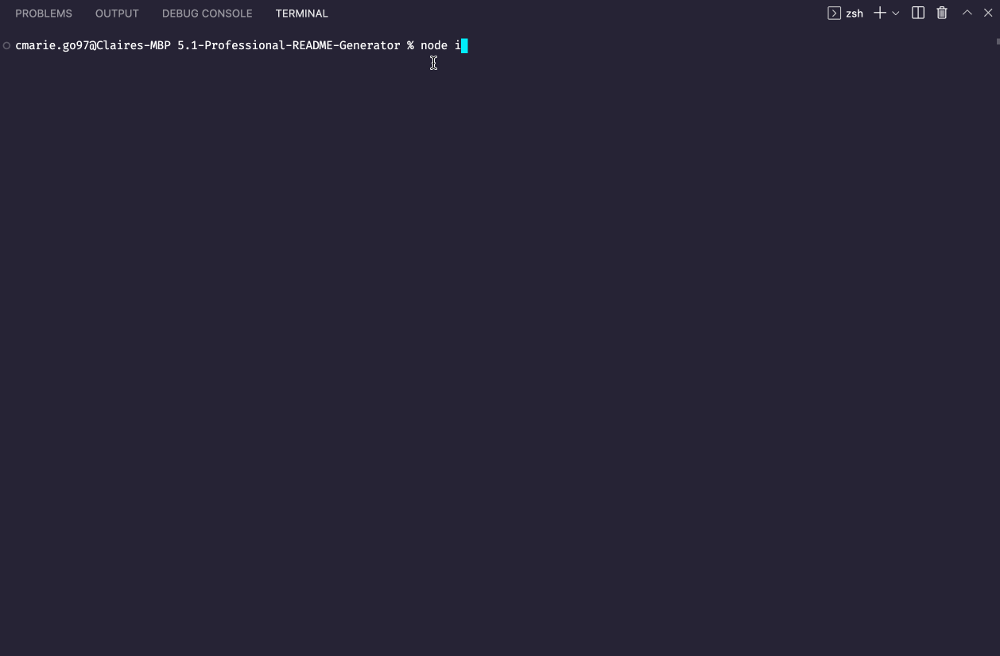
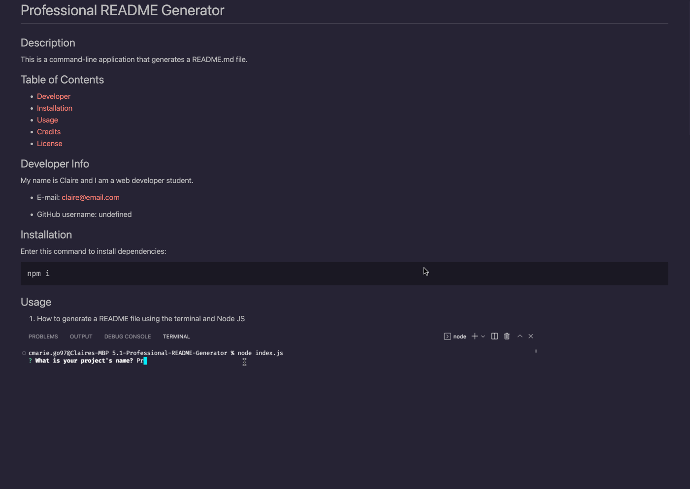

# A Very Professional README Generator

## Description
This is command-line application that generates a professional README.md file from a user's input with the inquirer package.

## Table of Contents

- [Installation](#installation)
- [Usage](#usage)
- [Credits](#credits)
- [License](#license)

## Developer Info

My name is Clarence and I am a web development student.

* GitHub username: cmarie.go97

## Installation

Enter this command to install dependencies:

~~~
npm i
~~~

## Usage

1. How to generate a README file using the terminal and Node JS

2. How the generated README file looks:

3. Markdown Preview demo:

4. This is an external link to a video demonstration of the application:

    https://app.castify.com/analyze/fb98f3c7-9a10-4a88-919a-852de59552c3

--------

This application will be invoked with the command:
~~~
node index.js
~~~

## Credits
Had some assistance from institution instructors.

--------

## License

## Tests

Enter this command to run tests:

~~~
npm init
~~~